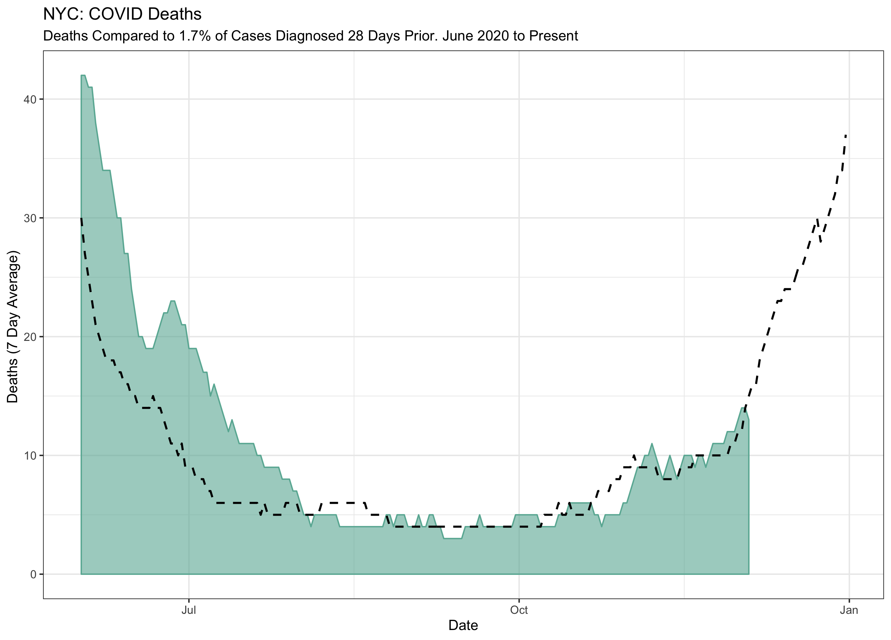
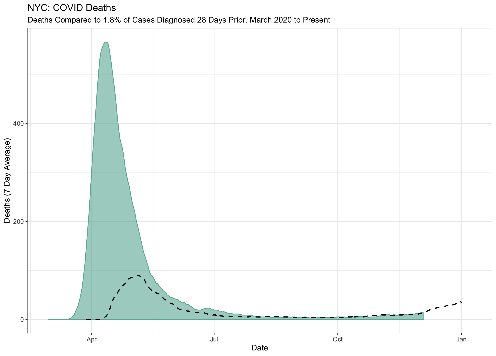
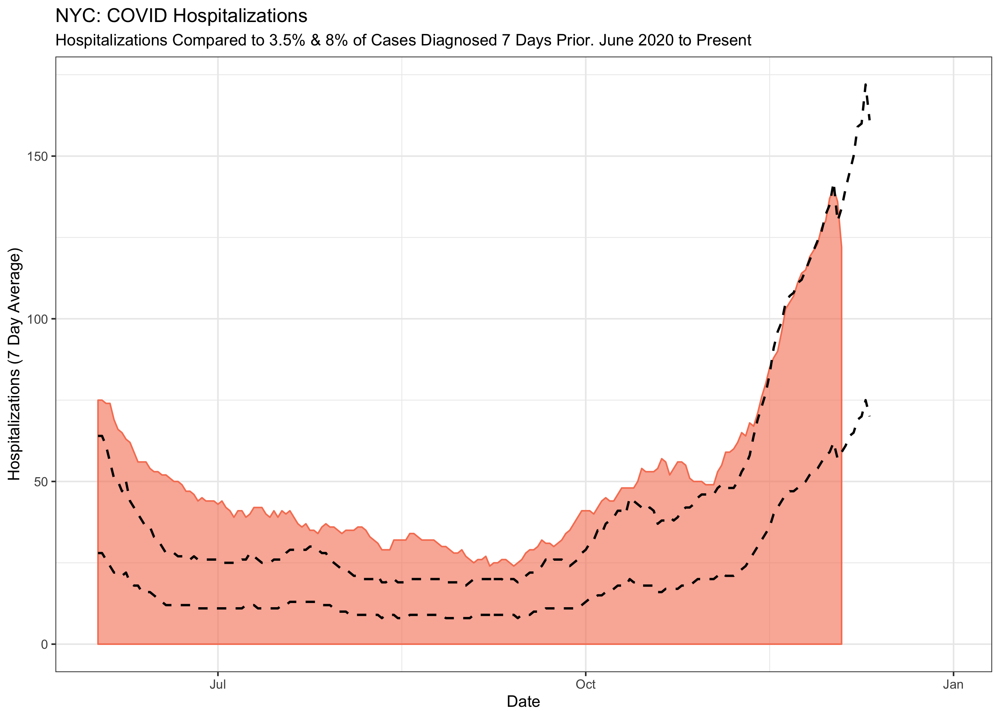

# NYC COVID

Crude hospitalization and death predictions inspired by viral tweets (well, viral within the public health community).

*Data Source*: [NYC Health's Coronavirus Data](https://github.com/nychealth/coronavirus-data), specifically the [day by day trends](https://github.com/nychealth/coronavirus-data/blob/master/trends/data-by-day.csv)

## Deaths: 1.8% of Cases Identified 28 days Prior

*Background*: [Trevor Bedford](https://twitter.com/trvrb/status/1334684100565725195?s=20) applied a simple formula: Deaths = 1.7% of cases diagnosed 22 days prior. In applying this to NYC data, I found that the lag appeared to by longer for NYC than it is nationally, possibly due to the more robust test and tracing process in NYC allowing for cases to be identified earlier and test results being recorded by the date of diagnosis rather than the date the test was resulted. My visualization adjusts for this difference and the lag between diagnosis and death is set at 28 days. 

*Visual*: Starting in the summer valley of cases and deaths, the line fits remarkably well. As cases and deaths have begun to creep up, the fit continues. Projecting 28 days into the future, this crude model predicts 37 deaths in NYC on December 31. 

Note: When the spring is included in the visualization, the sheer magnitude of lives lost is haunting. Undoubtedly the CFR was higher then, due to the difficulties of fighting a new disease and the strain it placed on hospitals and emergency services. 

*Future*: NYC's reporting of cases stratified by age allows for more detailed predictions of deaths based on CFR by age group

## Hospitalizations: ?

*Background*: [Dr. Ashish Jha](https://twitter.com/ashishkjha/status/1333636842307137537?s=20) applied a similarly simple formula: Hospitalizations = 3.5% of cases diagnosed 7 days prior. 

*Visual*: When applied to recent NYC data, this ratio does not hold. NYC cases are hospitalized at a rate closer to 8%. Given that this is based on a back-of-the-napkin twitter analysis, it isn't shocking to find that it doesn't fit real world data but it peaks my interest in COVID hospitalization rates and how they vary across the nation

